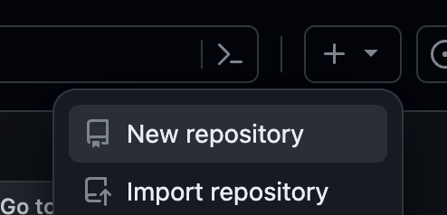
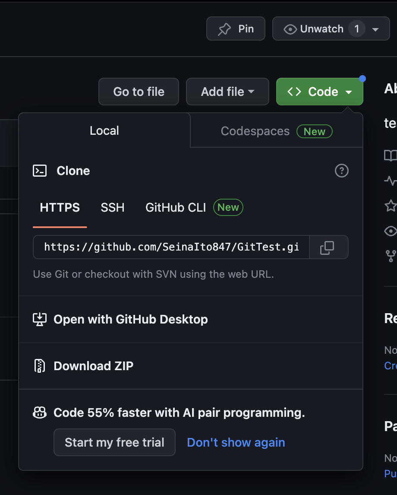

# Git Flow

## 新しいリポジトリ作成（プロジェクトみたいなもの）
1. Gitのコンソール開く
2. 右上（プロフィールの左横）の＋マーク

3. New Repository


## git cloneする
1. ローカルで管理するディレクトリを作成する
   ```sh
   cd Document/study
   mkdir git
   cd git
   ```
2. リモートのリポジトリをクローンする
   ```sh
   git clone https://github.com/SeinaIto847/GitTest.git
   ```
   
   